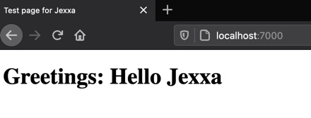

# HelloJexxa

## What You Learn

1.  [How to write a simple application using Jexxa](#1-Write-the-application)
2.  [How to add a web page](#2-Add-a-Web-Page)

## What you need

*   30 minutes
*   JDK 17 (or higher) installed 
*   Maven 3.6 (or higher) installed
*   A web browser
*   curl to access the web page via command line (optional)

## 1. Write the application

### Create a Maven project 

All IDEs such as IntelliJ or Eclipse provide a way to create a new maven project that you can use to create your HelloJexxa program. Then add the following dependencies to the `pom.xml` to use Jexxa and to print log information to the console. 

```xml
<project> 
    <!-- ... maven project declaration generated by your IDE or maven ... -->
    
    <!-- Add following dependencies into the project definition -->
   <dependencies>
       <dependency>
          <groupId>io.jexxa</groupId>
          <artifactId>jexxa-web</artifactId>
          <version>5.7.0</version>
       </dependency>
       
       <dependency>
           <groupId>org.slf4j</groupId>
           <artifactId>slf4j-simple</artifactId>
           <version>2.0.6</version>
       </dependency>
   </dependencies>
</project>
```

### Write the main method 
The source code of the main method is quite simple. Each line include comments to explain the meaning.  

```java
import io.jexxa.core.JexxaMain;
import io.jexxa.drivingadapter.rest.RESTfulRPCAdapter;

public final class HelloJexxa
{
    @SuppressWarnings({"java:S3400", "unused"})
    // Our business logic ;-)
    public String greetings()
    {
        return "Hello Jexxa";
    }

    public static void main(String[] args)
    {
        //Create your jexxaMain for this application
        var jexxaMain = new JexxaMain(HelloJexxa.class);

        jexxaMain
                // Bind a REST adapter to expose parts of the application
                .bind(RESTfulRPCAdapter.class).to(HelloJexxa.class)               // Get greetings: http://localhost:7501/HelloJexxa/greetings
                .bind(RESTfulRPCAdapter.class).to(jexxaMain.getBoundedContext())  // Get stats: http://localhost:7501/BoundedContext/isRunning

                // Run your application until Ctrl-C is pressed
                .run();
    }
}
```

### Configure your Application

Before we can run your application, we need to configure network port and address for HTTP access via a properties file. The default properties file used in jexxa
is named `jexxa-application.properties`. Add a file into the `resources` directory of your project and add the following
content:
```properties
#Settings for RESTfulRPCAdapter
io.jexxa.rest.host=0.0.0.0
io.jexxa.rest.port=7501
```

### Compile & Start the Application
Compile and start the program via your IDE. As soon as you start the application, you should see following (or similar) output

```console
[main] INFO io.jexxa.utils.JexxaBanner - Config Information: 
[main] INFO io.jexxa.utils.JexxaBanner - Jexxa Version                  : VersionInfo[version=5.7.0, repository=scm:git:https://github.com/jexxa-projects/Jexxa.git/jexxa-core, projectName=Jexxa-Core, buildTimestamp=2023-01-21T17:05:30+0000]
[main] INFO io.jexxa.utils.JexxaBanner - Context Version                : VersionInfo[version=, repository=, projectName=HelloJexxa, buildTimestamp=]
[main] INFO io.jexxa.utils.JexxaBanner - Used Driving Adapter           : [RESTfulRPCAdapter]
[main] INFO io.jexxa.utils.JexxaBanner - Used Properties Files          : [/jexxa-application.properties]
[main] INFO io.jexxa.utils.JexxaBanner - 
[main] INFO io.jexxa.utils.JexxaBanner - Access Information: 
[main] INFO io.jexxa.utils.JexxaBanner - Listening on: http://0.0.0.0:7501
```

To run the application from console enter: 
```console                                                          
java -jar ./target/hellojexxa-jar-with-dependencies.jar
```
### Access the application
To access the application you can either use your favorite web browser, or a command line tool like 'curl'. 

*   Check if context is up and running:
    *   URL: http://localhost:7501/BoundedContext/isRunning
    *   Result:
    ```Json 
        true
    ```
    
*   Access our business function `greetings`:
    *   URL: http://localhost:7501/HelloJexxa/greetings
    *   Result: 
    ```Json 
        "Hello Jexxa" 
    ```
## 2. Add a Web Page

### Write the Web Page 

For simplicity, we add our web page into the same project as our backend by performing following steps: 

* Create directory `public` into our `resources` directory that will include our web page
* Extend `jexxa-application.properties` by following lines so that this directory is exposed as web directory 
  ```properties
  io.jexxa.rest.static.files.root=src/main/resources/public
  io.jexxa.rest.static.files.external=true
  ```
* Finally, add web page `index.html` with following content into `resources/public`:
    ```html
    <!DOCTYPE html>
    <html lang="en">
    <head>
        <meta http-equiv="Content-Type" content="text/html; charset=utf-8"/>
        <title> Test page for Jexxa </title>
    </head>
    
    <body>
    <h1 id = "greetings">Greetings: </h1>
    
    <script>
        const BASE_URL = window.location.protocol + '//' + location.host;
    
        //Append greetings message to heading
        const appendToDOM = (message) => {
            document
                .querySelector("#greetings")
                .append(message);
        };
    
        //Method to query greetings and append it to DOM
        const fetchGreetings = () => {
            fetch(`${BASE_URL}/HelloJexxa/greetings`)
                .then( response => {
                    if (!response.ok) {
                        throw Error(response.statusText);
                    }
                    return response.json();
                })
                .then(data => {
                    console.log(`GET contextName`, data);
                    // append to DOM
                    appendToDOM(data);
                })
                .catch(error => console.error(error));
        };
    
        fetchGreetings();
    </script>
    </body>
    </html>
    ```

### Access the Web Page

After restarting the application, you can access the web page via following link [http://localhost:7501/index.html](http://localhost:7501/index.html). The result should look like this:



This web page can be used as starting point for developing your own web page.


## Final notes
The steps described in this tutorial are written in a way that you can use it in any modern IDE. The source code we provide in this repository is based on the [JexxaTemplate](https://github.com/jexxa-projects/JexxaTemplate/) which uses additional maven plugins. As soon as you start developing a project for production use, you should use this template.    

